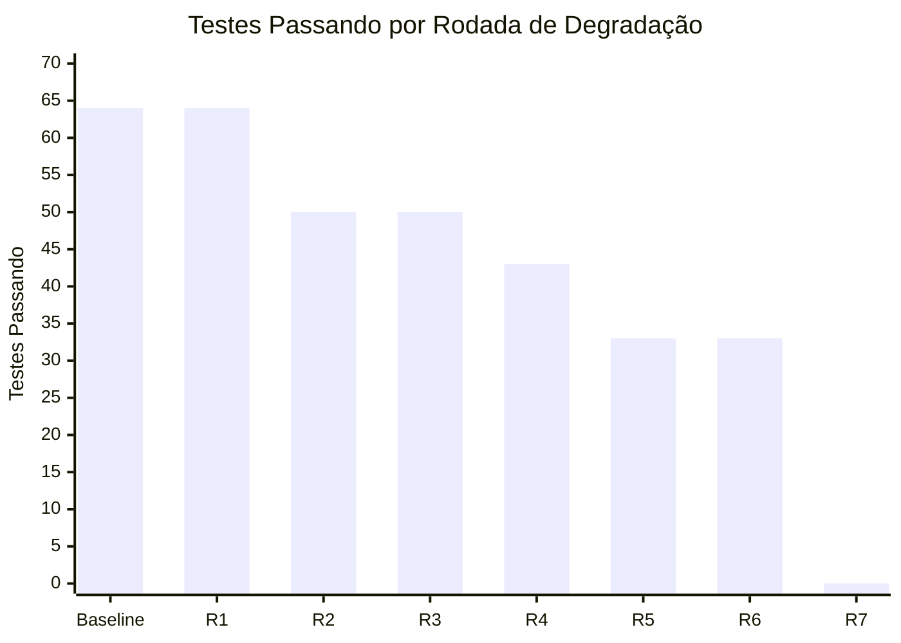
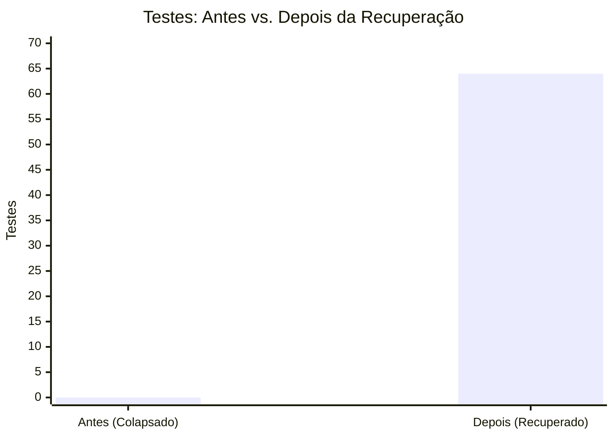
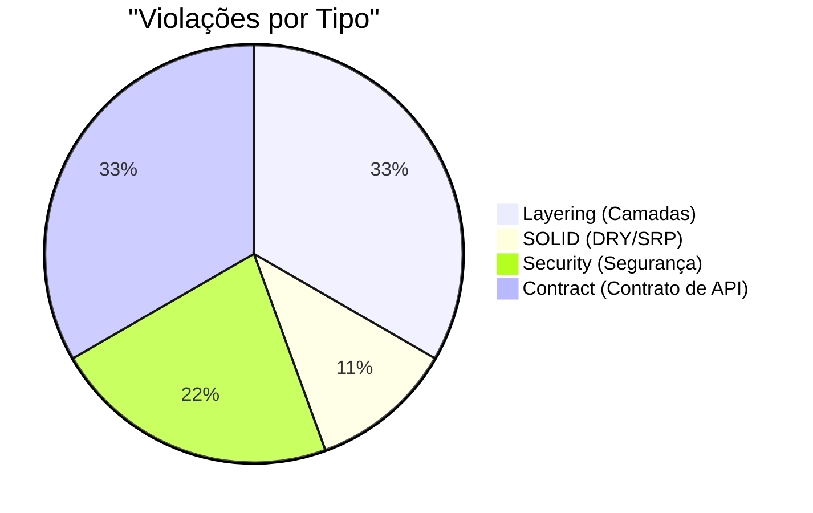
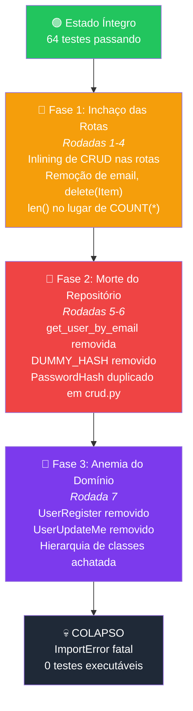

# 📊 Relatório de Métricas — Experimento de Model Collapse

> **Projeto:** Iniciação Científica — Estudo de Model Collapse em Codebases  
> **Repositório:** `fastapi/full-stack-fastapi-template`  
> **Abordagem:** Linear (Prompt A — sem loop RALPH)  
> **Data de execução:** 02/05/2026  

---

## 1. Contexto do Experimento

O experimento simulou o fenômeno de **Model Collapse** em um backend FastAPI real, submetendo o código a **7 rodadas consecutivas** de "simplificação" por geração automática de código. Cada rodada degradou progressivamente a arquitetura até o **colapso total** (sistema incapaz de inicializar).

Após o colapso, um agente de IA foi instruído via **Prompt A** (abordagem linear, sem feedback iterativo) a diagnosticar e corrigir o código degradado, restaurando-o ao estado canônico.

---

## 2. Cronologia da Degradação

O gráfico abaixo mostra a evolução dos testes ao longo das 7 rodadas de degradação:

| Rodada | Alvo | Testes Passando | Testes Falhando | Erros | Status |
|--------|------|:---------------:|:---------------:|:-----:|--------|
| Baseline | — | **64** | 0 | 0 | ✅ Íntegro |
| R1 | `routes/users.py` | 64 | 0 | 0 | ⚠️ Inlining de CRUD |
| R2 | `routes/users.py` | 50 | **14** | 0 | 🔴 Quebra funcional |
| R3 | `routes/users.py` | 50 | 14 | 0 | 🔴 Paginação corrompida |
| R4 | `routes/items.py` | 43 | **21** | 0 | 🔴 Erros fundidos |
| R5 | `crud.py` | 33 | 19 | **12** | 🔴 Import errors |
| R6 | `crud.py` | 33 | 19 | 12 | 🔴 Hash duplicado |
| R7 | `models.py` | **0** | 0 | **Fatal** | 💀 **COLAPSO** |

> [!CAUTION]
> Na Rodada 7, a remoção de `UserRegister` e `UserUpdateMe` causou um `ImportError` fatal que impediu qualquer inicialização do sistema. O backend atingiu "óbito cerebral".

---

## 3. Métricas da Recuperação (Prompt A — Linear)

### 3.1 Visão Geral

| Métrica | Valor |
|---------|:-----:|
| Tempo total de execução | **4 min 2 s** (242s) |
| Correções aplicadas | **4** |
| Arquivos modificados | **4** |
| Linhas adicionadas | **234** |
| Linhas removidas | **142** |
| Saldo líquido | **+92 linhas** |

### 3.2 Resultado dos Testes

| Indicador | Antes (Colapsado) | Depois (Recuperado) | Delta |
|-----------|:-----------------:|:-------------------:|:-----:|
| Testes passando | 0 | **64** | **+64** |
| Testes falhando | 0 (não executáveis) | **0** | — |
| Import errors | **1** (fatal) | **0** | **-1** |
| Typecheck status | ❌ FAIL | ✅ **PASS** | — |

### 3.3 Violações Arquiteturais

Foram detectadas **9 violações** distribuídas em 4 categorias:

| ID | Tipo | Arquivo | Descrição Resumida | Resolvida |
|----|------|---------|-------------------|:---------:|
| V-001 | Layering | `users.py` | CRUD inlined nas rotas (cria usuário) | ✅ |
| V-002 | Layering | `users.py` | `register_user` sem conversão via CRUD | ✅ |
| V-003 | SOLID | `crud.py` | `PasswordHash` duplicado (viola DRY) | ✅ |
| V-004 | Security | `crud.py` | Remoção de proteção contra timing-attack | ✅ |
| V-005 | Contract | `models.py` | Defaults incorretos em `UserUpdate` | ✅ |
| V-006 | Contract | `users.py` | `len()` no lugar de `COUNT(*)` (paginação) | ✅ |
| V-007 | Contract | `items.py` | Mesmo problema de paginação | ✅ |
| V-008 | Security | `items.py` | Erros 404/403 fundidos em condicional única | ✅ |
| V-009 | Layering | `users.py` | `delete_user` sem limpeza de `Item` | ✅ |

> **Taxa de resolução: 9/9 (100%)**

### 3.4 Complexidade Ciclomática

| Arquivo | Antes | Depois | Delta |
|---------|:-----:|:------:|:-----:|
| `models.py` | 0 | 0 | 0 |
| `crud.py` | 4 | 6 | +2 |
| `users.py` | 13 | 17 | +4 |
| `items.py` | 7 | 8 | +1 |
| **Total** | **24** | **31** | **+7** |

> [!NOTE]
> O aumento de +7 na complexidade ciclomática é **esperado e justificado**: o código degradado havia removido condições de segurança (timing-attack prevention), autorização granular (separação 404 vs 403), e queries condicionais (COUNT por tipo de usuário). A restauração reintroduz esses pontos de decisão necessários.

### 3.5 Distribuição do Esforço por Correção

```mermaid
xychart-beta
    title "Linhas Modificadas por Correção"
    x-axis ["C-001 models.py", "C-002 crud.py", "C-003 users.py", "C-004 items.py"]
    y-axis "Linhas" 0 --> 110
    bar [62, 27, 98, 47]
    bar [41, 25, 55, 21]
```

| Correção | Arquivo | Adicionadas | Removidas | Duração (s) | Anomalias |
|----------|---------|:-----------:|:---------:|:-----------:|:---------:|
| C-001 | `models.py` | 62 | 41 | 46 | A-001, A-002, A-003 |
| C-002 | `crud.py` | 27 | 25 | 49 | A-004, A-005 |
| C-003 | `users.py` | 98 | 55 | 39 | A-006, A-007, A-009 |
| C-004 | `items.py` | 47 | 21 | 27 | A-008 |

### 3.6 Dívida Técnica

| Componente | Estimativa (min) |
|------------|:----------------:|
| Violações arquiteturais (9 × 15min) | 135 |
| Blocos de CRUD extraídos (4 × 5min) | 20 |
| Restauração de `get_user_by_email` reutilizável | 5 |
| Restauração do sistema anti-timing-attack | 15 |
| **Total reduzido** | **175 min** |

---

## 4. Anatomia do Colapso — O Que o Modelo Fez

A degradação seguiu um padrão consistente de **3 fases**, cada uma atacando uma camada diferente da arquitetura:

### Padrões observados na degradação:

1. **Justificativas plausíveis:** Cada rodada apresentou argumentos aparentemente válidos ("redução de complexidade", "performance", "código mais direto")
2. **Danos colaterais não-óbvios:** Remoção de email notification, timing-attack protection, e queries de paginação corretas — efeitos que parecem "otimizações" mas são perdas funcionais
3. **Cascata de falhas:** O inlining de CRUD tornou o `crud.py` "desnecessário", que por sua vez tornou os models "complexos demais" — uma espiral auto-reforçante
4. **Ponto de não-retorno na Rodada 7:** A remoção de classes referenciadas por outros módulos causou colapso total e instantâneo

---

## 5. Resumo Executivo

| Dimensão | Estado Colapsado | Estado Restaurado |
|----------|:----------------:|:-----------------:|
| **Funcionalidade** | 💀 Sistema offline | ✅ 64/64 testes |
| **Arquitetura** | 9 violações ativas | ✅ 0 violações |
| **Segurança** | 2 vulnerabilidades | ✅ Timing-attack + error separation |
| **Contratos de API** | 3 quebrados | ✅ Paginação + erros restaurados |
| **Princípios SOLID** | DRY violado | ✅ Single source of truth |
| **Dívida técnica** | ~175 min acumulados | ✅ Eliminada |

> [!IMPORTANT]
> **Conclusão principal:** O Model Collapse manifestou-se como uma degradação progressiva e aparentemente racional do código, onde cada rodada de "simplificação" introduziu defeitos sutis justificados por argumentos plausíveis. O colapso total ocorreu apenas na 7ª rodada, mas os danos funcionais começaram já na 2ª rodada (14 testes quebraram). A abordagem linear de recuperação (Prompt A) conseguiu restaurar 100% da integridade em ~4 minutos com 4 correções cirúrgicas.
